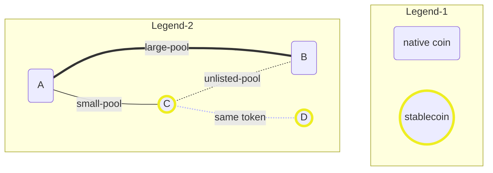
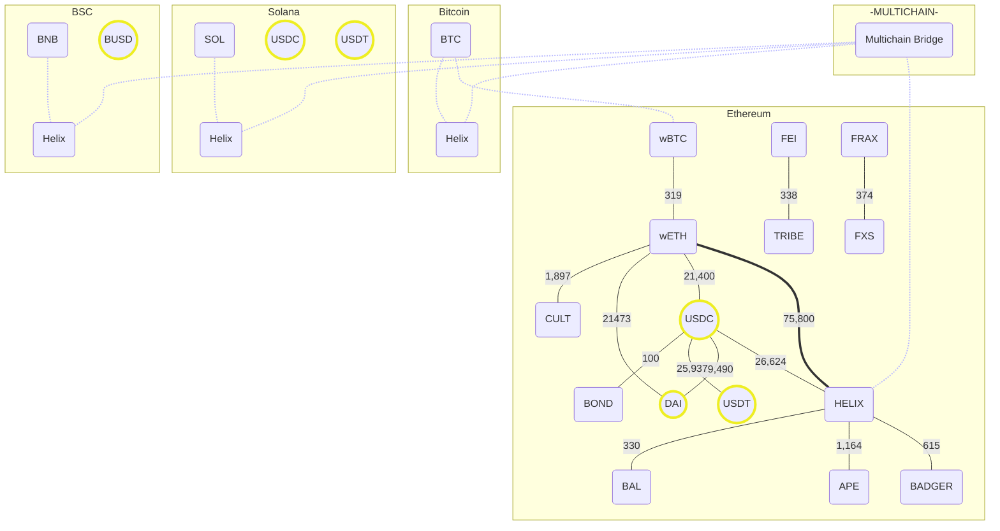

Keeping track of liquidity pool size and paths here to identify optimal routes.

* [Link to LP Farms](https://helix.finance/farms)
* [Mermaid Online Editor](https://mermaid.live/edit#pako:eNqNkm1vgjAQx79KU9_UpCzOqUgXX4iQuGTRZLh3JEuF8hALGCjRRfzuK-ADU7bYpNf27tf_XS89QCdxGSTQ48nOCWgq7BjI4XCaZQbzQCbomjPghZyTju_7OBNpsmGkY5r9017Zha4IyGC7f7Xj-nqWr_2UbgNgioClLI9qdzl25mqOStO9-uaMh3tU2YZXMl-fljFDqLTdLiGkruYOWVXIqhUxpm8ISdMarFKCyWQCiqGGR72x9BVVib8EgPKkgELD6lgrLmXdFwoURWIqVtXnVpEyOsY9dXgbPT-jzjPAI210m4fF7l1zrYTTmF5l5BlZy_dGC-Xpvxa2iepW42X6QkdyNhT1Wq5cHpJbmNOPv6PL8nuAWUDDGPQfw14uGMQwYmlEQ1f-30PptqEEI2ZDIrcuTTc2tOOj5PKtSwUz3VAkKSQe5RnDkOYisb5jBxKR5uwMGSGVSaMTdfwBo0rmMQ)

___

___

Reference Quotes:

- *"yes that's right.. you'll be able to move HELIX from Bitcoin to Ethereum to Solana to BSC by the end of the expansion, each network will have HELIX-WETH, or HELIX-RBTC, or HELIX-SOL, or HELIX-BNB you'll be able to then enter that market via"* ([link](https://discord.com/channels/894851963483750430/894855639942176799/1002198215560544307))
