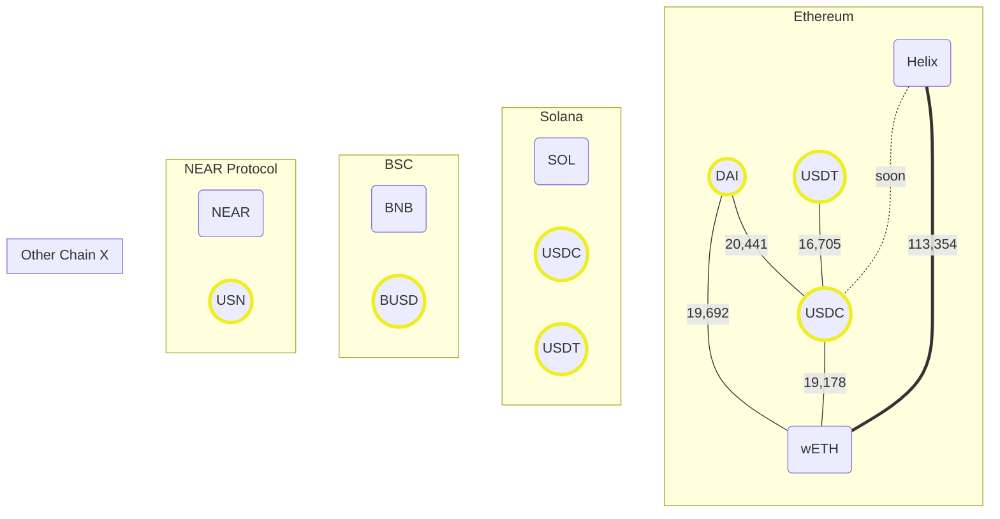

Keeping track of liquidity pool size and paths here to identify optimal routes.

* [Link to LP Farms](https://helix.finance/farms)
* [Mermaid Online Editor](https://mermaid.live/edit#pako:eNqNkm1vgjAQx79KU9_UpCzOqUgXX4iQuGTRZLh3JEuF8hALGCjRRfzuK-ADU7bYpNf27tf_XS89QCdxGSTQ48nOCWgq7BjI4XCaZQbzQCbomjPghZyTju_7OBNpsmGkY5r9017Zha4IyGC7f7Xj-nqWr_2UbgNgioClLI9qdzl25mqOStO9-uaMh3tU2YZXMl-fljFDqLTdLiGkruYOWVXIqhUxpm8ISdMarFKCyWQCiqGGR72x9BVVib8EgPKkgELD6lgrLmXdFwoURWIqVtXnVpEyOsY9dXgbPT-jzjPAI210m4fF7l1zrYTTmF5l5BlZy_dGC-Xpvxa2iepW42X6QkdyNhT1Wq5cHpJbmNOPv6PL8nuAWUDDGPQfw14uGMQwYmlEQ1f-30PptqEEI2ZDIrcuTTc2tOOj5PKtSwUz3VAkKSQe5RnDkOYisb5jBxKR5uwMGSGVSaMTdfwBo0rmMQ)

