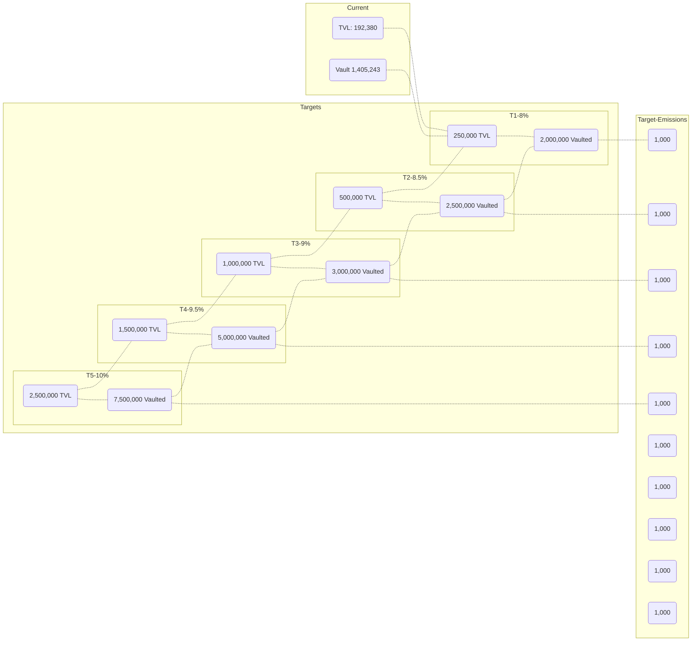

```mermaid

flowchart LR
    classDef unmet fill:#ggg,stroke:#EE2,stroke-width:4px;
    classDef met fill:#ggg,stroke:#EE2,stroke-width:4px;

    subgraph Current
        curr-tvl(TVL: 192,380)
        curr-vault(Vault 1,405,243)
        end
    
    curr-tvl -.- tvl-1
    curr-vault -.- tvl-1

    subgraph Targets
        direction LR
        subgraph T1-8%
            tvl-1(250,000 TVL)
            v-1(2,000,000 Vaulted)
            tvl-1 -.- v-1
            end

        subgraph T2-8.5%
            tvl-2(500,000 TVL)
            v-2(2,500,000 Vaulted)
            tvl-2 -.- v-2
            end
        tvl-2 -.- tvl-1
        v-2 -.- v-1

        subgraph T3-9%
            tvl-3(1,000,000 TVL)
            v-3(3,000,000 Vaulted)
            tvl-3 -.- v-3
            end
        tvl-3 -.- tvl-2
        v-3 -.- v-2

        subgraph T4-9.5%
            tvl-4(1,500,000 TVL)
            v-4(5,000,000 Vaulted)
            tvl-4 -.- v-4
            end
        tvl-4 -.- tvl-3
        v-4 -.- v-3

        subgraph T5-10%
            tvl-5(2,500,000 TVL)
            v-5(7,500,000 Vaulted)
            tvl-5 -.- v-5
            end
        tvl-5 -.- tvl-4
        v-5 -.- v-4

        end

    subgraph Target-Emissions
    direction BT
        TE1(1,000)
        TE2(1,000)
        TE3(1,000)
        TE4(1,000)
        TE5(1,000)
        TE6(1,000)
        TE7(1,000)
        TE8(1,000)
        TE9(1,000)
        TE10(1,000)
        
        v-1  -.- TE1
        v-2 -.- TE2
        v-3 -.- TE3
        v-4 -.- TE4
        v-5 -.- TE5
        end
```
