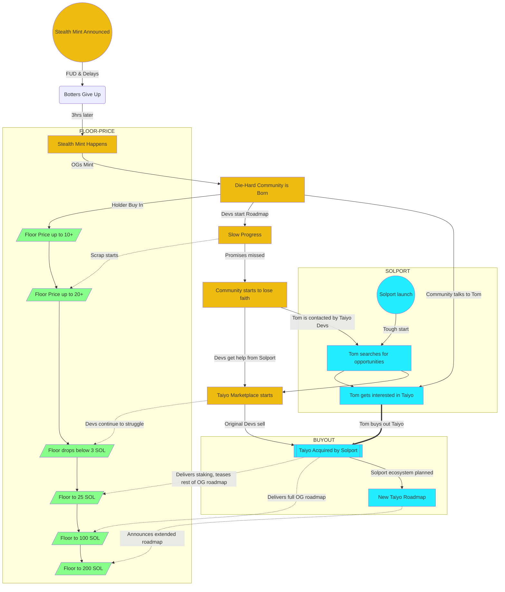

```mermaid
graph TD
    classDef SPT fill:#2Ef;
    classDef TYR fill:#EB1;
    classDef FP fill:#8F8;
    A((Stealth Mint Announced)):::TYR -->|FUD & Delays| B(Botters Give Up)
    B -->|3hrs later| C[Stealth Mint Happens]:::TYR
    C -->|OGs Mint| D[Die-Hard Community is Born]:::TYR
    D -->|Devs start Roadmap| E[Slow Progress]:::TYR
    D -->|Holder Buy In| F[/Floor Price up to 10+/]
    E -.->|Scrap starts| G[/Floor Price up to 20+/]
    E --> |Promises missed| H[Community starts to lose faith]:::TYR
    H --> |Devs get help from Solport| I[Taiyo Marketplace starts]:::TYR
    I -.-> |Devs continue to struggle| J[/Floor drops below 3 SOL/]
    D --> |Community talks to Tom| K[Tom gets interested in Taiyo]
    L((Solport launch)) --> |Tough start| M[Tom searches for opportunities]
    H --> |Tom is contacted by Taiyo Devs| M
    M --> K
    M --> I
    I --> |Original Devs sell| N
    K ==> |Tom buys out Taiyo| N[[Taiyo Acquired by Solport]]
    N -.-> |Delivers staking, teases rest of OG roadmap| O[/Floor to 25 SOL/]
    N -.-> |Delivers full OG roadmap| P[/Floor to 100 SOL/]
    N --> |Solport ecosystem planned| R[New Taiyo Roadmap]
    R -.-> |Announces extended roadmap| Q[/Floor to 200 SOL/]
    subgraph FLOOR-PRICE
    C
    F:::FP --> G
    G:::FP --> J
    J:::FP --> O
    O:::FP --> P
    P:::FP --> Q:::FP
    end
    subgraph SOLPORT
    L:::SPT
    M:::SPT
    K:::SPT
    end
    subgraph BUYOUT
    N:::SPT
    R:::SPT
    end
```
